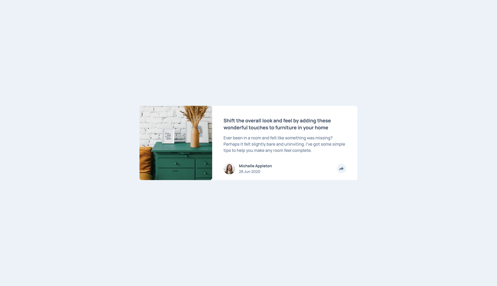
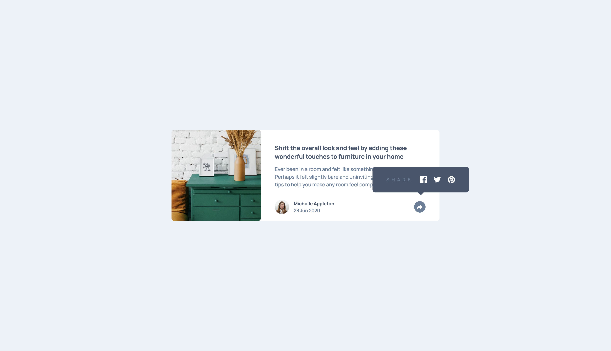
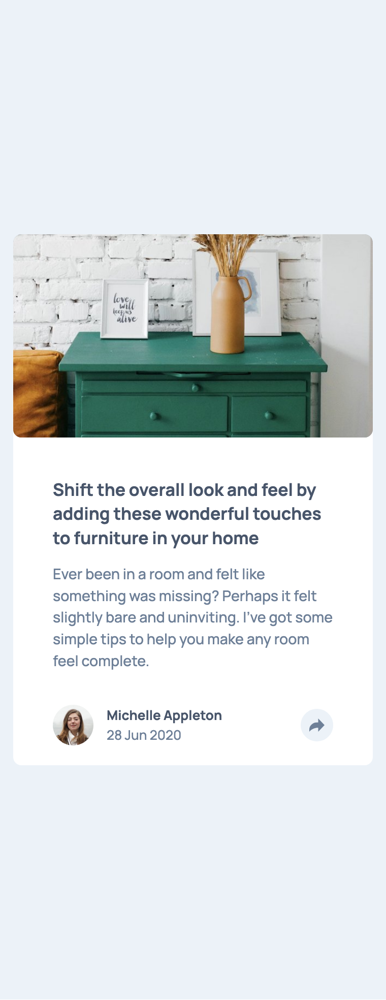
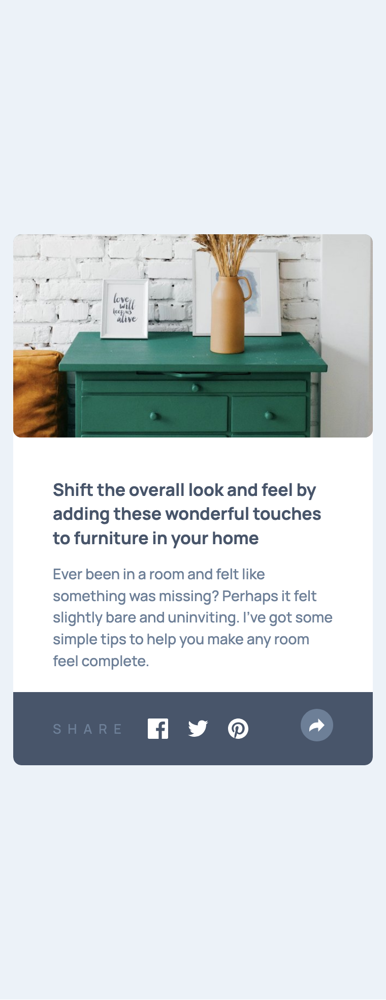

# Frontend Mentor - Article preview component solution

This is a solution to the [Article preview component challenge on Frontend Mentor](https://www.frontendmentor.io/challenges/article-preview-component-dYBN_pYFT). Frontend Mentor challenges help you improve your coding skills by building realistic projects.

## Table of contents

- [Frontend Mentor - Article preview component solution](#frontend-mentor---article-preview-component-solution)
  - [Table of contents](#table-of-contents)
  - [Overview](#overview)
    - [The challenge](#the-challenge)
    - [Screenshot](#screenshot)
    - [Links](#links)
  - [My process](#my-process)
    - [Built with](#built-with)
    - [What I learned](#what-i-learned)
  - [Author](#author)

## Overview

### The challenge

Users should be able to:

- View the optimal layout for the component depending on their device's screen size
- See the social media share links when they click the share icon

### Screenshot






### Links

- Solution URL: [Add solution URL here](https://your-solution-url.com)
- Live Site URL: [Add live site URL here](https://your-live-site-url.com)

## My process

### Built with

- Semantic HTML5 markup
- CSS custom properties
- Flexbox
- CSS Grid
- Mobile-first workflow
- SCSS
- CSS Tricks

### What I learned

```scss
/* A way to make a triangle with transparent borders */
.card-share-content {
  left: 93%;
  bottom: rem(80px);
  width: rem(270px);
  justify-content: center;
  padding: 0rem 2rem;
  border-radius: rem(8px);
  letter-spacing: 0.5rem;
  background-color: $very-dark-grayish-blue;
  opacity: 0;
  visibility: hidden;
  z-index: 1;

  // 2) Center horizontally above the share button:
  position: absolute;
  /* 
      We want the tooltip just above the share button, hidden at first. 
      “translateY(100%)” pushes it below its normal (bottom edge).
    */
  transform: translate(-50%, 100%);
  transition: transform 0.25s ease, opacity 0.2s ease, visibility 0.2s ease;

  // 3) Draw the little downward arrow using a pseudo‐element:
  &::after {
    content: '';
    position: absolute;
    bottom: rem(-8px); // 6px below the tooltip’s bottom edge
    left: 50%; // horizontally centered
    transform: translateX(-50%);
    width: 0;
    height: 0;
    border-left: rem(8px) solid transparent;
    border-right: rem(8px) solid transparent;
    border-top: rem(8px) solid $very-dark-grayish-blue;
    /* This triangle’s color must match the tooltip background */
  }

  // 4) When “active,” slide the tooltip into view:
  &.active {
    transform: translate(-50%, 0);
    // fully visible, aligned at its bottom edge
    opacity: 1;
    visibility: visible;
  }
}
```

## Author

- LinkedIn - [Daniel Lee](https://www.linkedin.com/in/uniqueimaginate/)
- Frontend Mentor - [@FR-UX-EN](https://www.frontendmentor.io/profile/FR-UX-EN)
